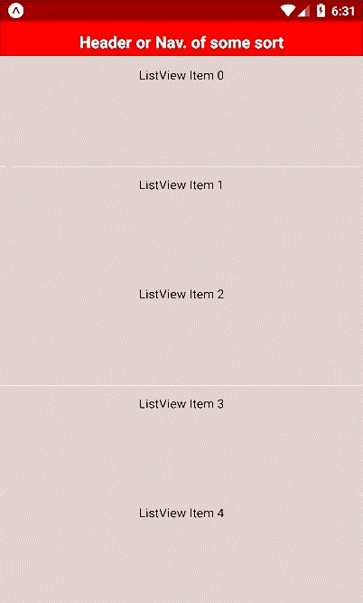

# react-native-simple-ptr

A simple pull to refresh component for React Native, adapted from [`react-native-animated-ptr`](https://github.com/evetstech/react-native-animated-ptr/).

 

## Why?
Because I wanted more control over the look and feel of the animation than I could get from the native `RefreshControl`, but less complex animations than `react-native-animated-ptr`.

This component allows you to specify a custom spinner image, down arrow, colours and sizes. If you need anything more custom than that, try the original [`react-native-animated-ptr`](https://github.com/evetstech/react-native-animated-ptr/).

## Installation
```npm i react-native-simple-ptr --save```

## Basic usage
If you use the default images and styles, the only props required are the `isRefreshing` variable and the `onRefresh` function.
```
import React from 'react';
import { ScrollView, Text } from 'react-native';

import PullToRefresh from 'react-native-simple-ptr';

export default class App extends React.Component {
  constructor(props) {
    super(props);

    this.state = {
      isRefreshing: false
    };
  }

  onRefresh() {
    this.setState({
      isRefreshing: true,
    });

    setTimeout(() => {
      this.setState({isRefreshing: false});
    }, 2000);
  }

  render() {
    return (
      <PullToRefresh isRefreshing={this.state.isRefreshing} onRefresh={this.onRefresh.bind(this)}>
        <ScrollView>
          <Text>Content</Text>
        </ScrollView>
      </PullToRefresh>
    );
  }
}
```

The images and styles can be changed using the options below. An implementation of all the options can be found in the [example](example).

## Options

#### `isRefreshing`
 Used to start/end refresh animation

#### `onRefresh`
Callback to control `isRefreshing`

#### `minPullDistance`
Height of refresh component (default: `62`)

#### `contentBackgroundColor`
Main app background colour (defaut: `#fff`)

#### `refreshBackgroundColor`
Refresh component background colour (default: `#e4e4e4`)

#### `arrow`
Pull to refresh arrow image(default `require('../assets/arrow-down.gif')`)

#### `arrowMaxHeight`
 Restrict the arrow image height (default: `30`)

#### `spinner`
 Loading spinner image (default: `require('../assets/spinner.gif')`)

#### `spinnerMaxHeight`
 Restrict the spinner image height (default: `30`)

#### `margin`
 Margin between images and refresh component edges (default: `16`)
