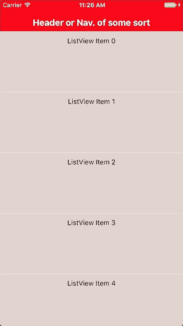
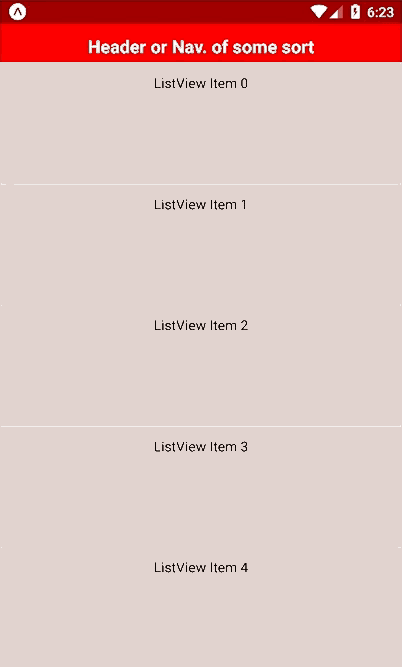

# react-native-simple-ptr

A customised example of a simple pull to refresh component for React Native, adapted from [`react-native-animated-ptr`](https://github.com/evetstech/react-native-animated-ptr/).

 


Try it out using Expo at: https://expo.io/@frontendbeast/react-native-simple-ptr-example

## Installation

```
git clone https://github.com/frontendbeast/react-native-simple-ptr.git
cd react-native-simple-ptr/example
npm install
```

If you do not have Expo XDE installed, [install it](https://docs.expo.io/versions/latest/introduction/installation.html).

Open the example directory with Expo XDE.
